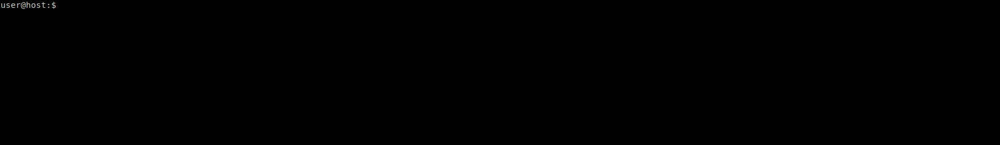

# ffmkv

A bash wrapper for FFMPEG with an Inquirer menu interface and progress monitoring.



## Features
- Selectable video and audio streams
- Selectable transcoding or stream copy for audio and video
- Can transcode to a specified file size or size per hour of video
- Supports x265
- Retains HDR
- Can convert HDR to SDR
- Supports presets
- Allows for resolution adjustments
- Retains subtitles
- Can build a sample video based on the specified number of seconds

## Installation
```
sudo curl https://raw.githubusercontent.com/Fmstrat/ffmkv/master/ffmkv -o /usr/local/bin/ffmkv
sudo chmod 755 /usr/local/bin/ffmkv
```

## Usage
To use the menuing system:
```
ffmkv <input> <output>
```

To use a preset:
```
ffmkv --preset '<preset>' <input> <output>
```

Examples:
```
ffmkv input.mkv output.mkv
ffmkv --preset 'Up to 4K, original audio, 4GB per hour VBR, HDR' input.mkv output.mkv
```

## Presets
A set of presets are defined in `~/.ffmkv/presets` after the first run. You may create your own presets using the format of the files located there.

## FFMPEG and zscale
This application requires a version of ffmpeg that supports the zscale filter to use resolution scaling and HDR to SDR conversion. If your version does not support zscale (default in Ubuntu 18.04) then please upgrade from https://ffmpeg.org

## Credits
- [Bash Inquirer Interface](https://www.github.com/tanhauhau/Inquirer.sh)
- [FFMPEG Progress Monitor](https://gist.github.com/pruperting/397509/) (Originally based on, rewritten)